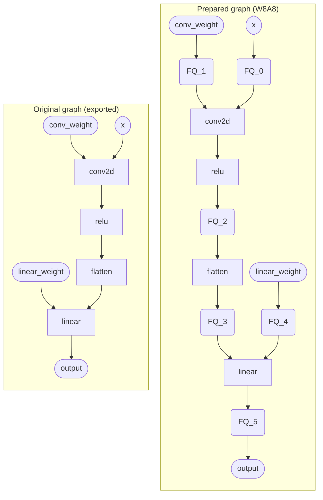

# Comparing Intermediate Activations

A common debugging question after preparing a compressed model is: *which layers are most affected by compression?* Comparing intermediate activation tensors of the compressed model against the uncompressed model, on the same inputs, can be a simple yet effective technique to identify the most impacted layers and tune the config accordingly (e.g., raise bit-width or skip quantization).

The recipe is:

1. Pick a small batch of representative inputs.
2. Run the uncompressed model and capture intermediate activations.
3. Run the prepared (compressed) model on the *same* inputs and capture activations at corresponding points.
4. For each pair of tensors, compute a similarity metric — signal-to-noise ratio (SNR) is a common choice.
5. Sort layers by SNR; the lowest values point to the layers most affected by compression.

The examples below use quantization (`Quantizer`), but the same recipe applies to any other compressor (e.g., `KMeansPalettizer`).

The wiring of step 3 differs between [eager mode and graph mode](../quantization/overview.md#two-execution-modes-graph-and-eager) because the prepared model has a different structure in each. The rest of this page walks through both.

```{note}
The code snippets below use `torch.randn(...)` for brevity, but random inputs drive the model through activation regions it rarely sees in practice, so the resulting SNR can rank layers differently from what real data would produce. Use representative data when applying this technique in practice.
```

## SNR helper

```python
import torch


def snr_db(reference: torch.Tensor, noisy: torch.Tensor) -> float:
    """SNR in dB between a reference tensor and a noisy approximation of it."""
    signal_power = reference.float().pow(2).mean()
    noise_power = (reference.float() - noisy.float()).pow(2).mean()
    if noise_power == 0:
        return float("inf")
    return 10.0 * torch.log10(signal_power / noise_power).item()
```

Higher SNR ⇒ smaller compression-induced error. A drop of tens of dB at one layer relative to its neighbors is a strong hint that the layer is sensitive to the configured spec.

## Example model

The code on this page uses the following toy `Conv2d → ReLU → Linear` model on MNIST-sized inputs (1×28×28):

```python
import torch.nn as nn


class ToyModel(nn.Module):
    def __init__(self):
        super().__init__()
        self.conv = nn.Conv2d(1, 8, 3, padding=1)
        self.relu = nn.ReLU()
        self.linear = nn.Linear(8 * 28 * 28, 10)

    def forward(self, x):
        x = self.relu(self.conv(x))
        return self.linear(x.flatten(1))
```

## Eager mode

In eager mode, `quantizer.prepare()` returns an `nn.Module` with the same submodule structure as the original — `prepared_model.layer1.conv1` lives at the same path as `model.layer1.conv1`. A forward hook on that path captures the *quantized* output on the prepared model and the *float* output on the original.

For weights, `prepare()` registers PyTorch parametrizations in-place, so accessing `.weight` on either model after `prepare()` returns the fake-quantized value — not the original float. To retain the float reference, save copies of the weights before calling `prepare()`.

### Activation collector

The following helpers capture each named submodule's output tensor using forward hooks:

```python
from collections import OrderedDict
import torch


def make_capture(store: dict[str, torch.Tensor], name: str):
    def hook(_module, _inputs, output):
        store[name] = output.detach().clone()

    return hook


def collect_outputs(
    target: torch.nn.Module, names: list[str], inputs
) -> dict[str, torch.Tensor]:
    store: dict[str, torch.Tensor] = OrderedDict()
    handles = [
        target.get_submodule(n).register_forward_hook(make_capture(store, n))
        for n in names
    ]
    try:
        with torch.no_grad():
            target(*inputs)
    finally:
        for h in handles:
            h.remove()
    return store
```

### Putting it together

```python
import torch
from coreai_opt.quantization import Quantizer, QuantizerConfig
from coreai_opt.quantization.config import ExecutionMode

model = ToyModel().eval()
example_inputs = (torch.randn(1, 1, 28, 28),)  # Use representative inputs in practice

# Collect all named submodules for activation capture.
target_names = [name for name, _ in model.named_modules() if name]

# Save weight copies before prepare — prepare() registers parametrizations in-place,
# making .weight return the fake-quantized value on both models after this point.
original_weights = {
    name: p.detach().clone() for name, p in model.named_parameters() if "weight" in name
}

# Capture float activations before preparing.
fp_acts = collect_outputs(model, target_names, example_inputs)

# Prepare and run to capture quantized activations.
config = QuantizerConfig(execution_mode=ExecutionMode.EAGER)
quantizer = Quantizer(model, config)
prepared_model = quantizer.prepare(example_inputs)
prepared_model.eval()
q_acts = collect_outputs(prepared_model, target_names, example_inputs)

# Print weight SNR.
for key, orig_w in original_weights.items():
    module_name = key.rsplit(".weight", 1)[0]
    quant_w = prepared_model.get_submodule(module_name).weight
    print(f"{key}: SNR = {snr_db(orig_w, quant_w):.2f} dB")

# Print activation SNR.
for name in target_names:
    print(f"{name}: SNR = {snr_db(fp_acts[name], q_acts[name]):.2f} dB")
```

Running `ToyModel` with the default INT8 config produces:

```text
conv.weight: SNR = 47.17 dB
linear.weight: SNR = 48.13 dB
conv: SNR = 38.87 dB
relu: SNR = 38.72 dB
linear: SNR = 37.46 dB
```

Biases are not quantized and are omitted (SNR = ∞). Activation SNRs are lower than weight SNRs and reflect accumulated error: each activation output is affected by the quantization of the weights feeding into that op, plus the quantization of its own output.

## Graph mode

In graph mode (the default), `quantizer.prepare()` runs `torch.export` and returns an `fx.GraphModule`. The original `nn.Module` hierarchy is flattened into a flat graph of named nodes (`conv2d`, `relu`, `linear`, `linear_weight`, …), and fake-quantize submodules (`activation_post_process_0`, `activation_post_process_1`, …) are inserted around the ops being quantized.

To compare cleanly, also export the *original* model with `torch.export`. Both graphs then share identical op-node names, so an op's float activation and its quantized counterpart can be looked up by the same key — no `nn.Module` ↔ graph-node mapping needed. However, on the prepared side, an op's *quantized* output sits on the fake-quantize node downstream of the op, not on the op itself. Build the op-to-FQ lookup by walking the prepared graph once.



*Left: original exported graph. Right: after W8A8 quantization. Rounded rectangles are FQ nodes (activation_post_process_N), present only in the prepared graph; op node names are identical in both graphs.*

### Activation collector

`register_forward_hook` only fires on `call_module` nodes — most ops in `fx.GraphModule` are `call_function` and have no module to attach to. To capture every tensor output by node name, drive the model with [`torch.fx.Interpreter`](https://docs.pytorch.org/docs/stable/fx.html#torch.fx.Interpreter):

```python
from collections import OrderedDict
import torch


class ActivationCollector(torch.fx.Interpreter):
    """Run an fx.GraphModule and capture every tensor output, keyed by node name."""

    def __init__(self, graph_module: torch.fx.GraphModule):
        super().__init__(graph_module)
        self.captured: dict[str, torch.Tensor] = OrderedDict()

    def run_node(self, n: torch.fx.Node):
        out = super().run_node(n)
        if isinstance(out, torch.Tensor):
            self.captured[n.name] = out.detach().clone()
        return out


def collect_node_outputs(gm, inputs) -> dict[str, torch.Tensor]:
    collector = ActivationCollector(gm)
    with torch.no_grad():
        collector.run(*inputs)
    return collector.captured
```

### Mapping ops to their fake-quantize nodes

When the prepared graph adds an `activation_post_process` node consuming an op's output, the *quantized* counterpart of that op output lives on the FQ, not on the op itself. Build the lookup with a single walk over the prepared graph:

```python
def op_to_fq(prepared: torch.fx.GraphModule) -> dict[str, str]:
    """Map each op (or weight/input) to the activation_post_process node consuming it."""
    mapping: dict[str, str] = {}
    for node in prepared.graph.nodes:
        if node.op != "call_module" or "activation_post_process" not in str(
            node.target
        ):
            continue
        if node.args:
            mapping[node.args[0].name] = node.name
    return mapping
```

This map covers *everything* the prepared graph fake-quantizes — weights, inputs, and op outputs alike. For a `Conv2d → ReLU → Linear` model with default quantization, the map looks like:

```python
{
    "x": "activation_post_process_0",  # input FQ
    "conv_weight": "activation_post_process_1",  # weight FQ
    "relu": "activation_post_process_2",  # output FQ for the conv→relu fused chain
    "flatten": "activation_post_process_3",  # shared quantizer through flatten
    "linear_weight": "activation_post_process_4",  # weight FQ
    "linear": "activation_post_process_5",  # output FQ
}
```

Two patterns to notice in this map:

- **Weight-only configs.** For weight-only configs, the map only has `*_weight` entries — weights are the only things being fake-quantized. Op nodes like `linear` and `conv2d` don't appear, but on the prepared side those ops already consume the fake-quantized weight, so their outputs already reflect the quantization. Just compare them by the same name on both sides.
- **Pattern fusion.** `conv2d` has no entry because graph mode fuses `conv → relu` and places the single output FQ after `relu`, not after `conv2d`. Comparing `conv2d` by the same name on both sides still works — the prepared graph's `conv2d` is computed from fake-quantized inputs and weights, so the SNR there reflects input + weight quantization error. The output-activation quantization error for the fused block shows up one row down, at `relu`.

### Putting it together

```python
import torch
from coreai_opt.quantization import Quantizer, QuantizerConfig

model = ToyModel().eval()
example_inputs = (torch.randn(1, 1, 28, 28),)  # Use representative inputs in practice

# 1. Export the original model so we can interpret it node-by-node, by name.
exported_original = torch.export.export(model, example_inputs).module()

# 2. Prepare the (graph-mode) compressed model. Same input names; adds FQs.
prepared = Quantizer(model, QuantizerConfig()).prepare(example_inputs)
prepared.eval()

# 3. Capture every tensor activation in both graphs.
float_acts = collect_node_outputs(exported_original, example_inputs)
quant_acts = collect_node_outputs(prepared, example_inputs)

# 4. For each op in the float graph, compare against its FQ node on the prepared
#    side if one exists, else against the same-named node.
fq_map = op_to_fq(prepared)
for name, fp in float_acts.items():
    target = fq_map.get(name, name)
    if target not in quant_acts or fp.shape != quant_acts[target].shape:
        continue
    print(f"{name:20s} -> {target:30s} SNR = {snr_db(fp, quant_acts[target]):.2f} dB")
```

You get one SNR row per *node* — weights, inputs, and op outputs alike.

Running `ToyModel` with the default INT8 config produces:

```text
conv_weight          -> activation_post_process_1      SNR = 47.17 dB
conv_bias            -> conv_bias                      SNR = inf dB
linear_weight        -> activation_post_process_4      SNR = 48.13 dB
linear_bias          -> linear_bias                    SNR = inf dB
x                    -> activation_post_process_0      SNR = 43.20 dB
conv2d               -> conv2d                         SNR = 42.40 dB
relu                 -> activation_post_process_2      SNR = 38.94 dB
flatten              -> activation_post_process_3      SNR = 38.94 dB
linear               -> activation_post_process_5      SNR = 35.74 dB
```

Biases report SNR = ∞ — they are not quantized and compare identically on both sides. `conv2d` (42.40 dB) sits higher than `relu` (38.94 dB) because it has no downstream FQ; its error comes only from the fake-quantized input and weights, while `relu` additionally incurs output-activation quantization from FQ_2. `relu` and `flatten` share the same SNR because `flatten` is a reshape over identical values backed by a shared quantizer. `linear` has the lowest SNR, accumulating error from both its weight and the quantized activation arriving from `flatten`.

## Acting on the results

Two patterns are common in the SNR table:

**Sudden drop at a single layer.** A sharp fall of tens of dB at one op — often visible on a weight or output FQ node — indicates that layer is particularly sensitive to the configured spec. Target it directly:

- **Skip the layer.** Set its entry to `None` to leave it at full precision — `module_name_configs={"...": None}`, `module_type_configs={...: None}`, `op_name_config={"...": None}`, or `op_type_config={"...": None}`. `QuantizerConfig.without(...)` is the convenience shortcut for the module-level case. See [Skip quantization for a specific layer type](../quantization/config.md#example-skip-quantization-for-a-specific-layer-type).
- **Raise its precision.** Replace the spec at that scope with a higher-bit dtype or a finer granularity (e.g., `PerBlockGranularity` instead of `PerChannelGranularity`). [Apply different configs to different module types](../quantization/config.md#example-apply-different-configs-to-different-module-types) shows the chaining pattern.

**Gradual drift across a sequence of layers.** When SNR declines steadily over several consecutive layers with no obvious single culprit, quantization error accumulates as it propagates through the network. Two approaches can help:

- **Skip the first few layers in the declining run.** Leaving the earliest affected layers at full precision prevents the initial error from accumulating downstream.
- **Raise precision across the region.** Apply a higher-bit or finer-granularity spec to all layers in the sequence. This limits how much error each layer contributes.

Re-run the same comparison after each config change to confirm the SNR at the targeted layers improved without regressing elsewhere.
